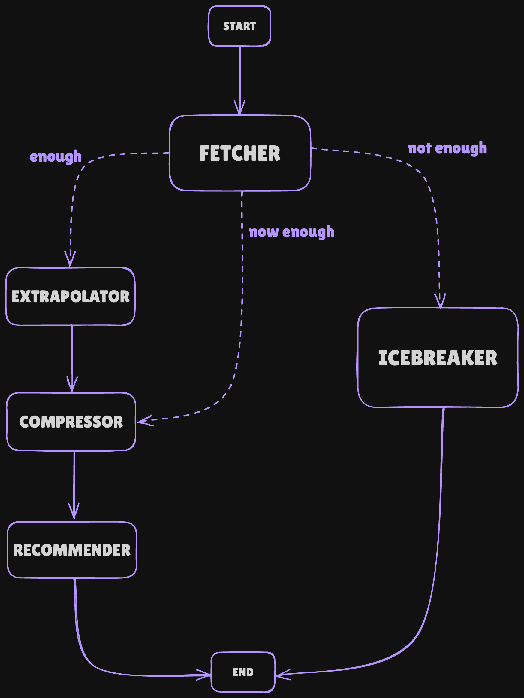

# 🤖 AI Agents for Feed Building & Social Prompting 

This project showcases several AI agents built using [*LangGraph*](https://www.langchain.com/langgraph) and [*Groq Inference*](https://groq.com/), designed to enhance interaction with the Farcaster decentralized social network. These agents leverage the powerful [*mbd*](https://www.mbd.xyz/) API to enable dynamic feed building and social prompting.

## 🔧 Building blocks
Using structured LangGraph workflows, we implement the two following agents.
Both agents maintain a contextual memory summary of the conversation, allowing them to interpret ambiguous user inputs, remember past user preferences throughout the session and reduce token usage.
All results are returned in a human-readable Markdown format.

### 1 – Feed Builder
Retrieve content from Farcaster network.
It can use several tools, including:
- Personalized feed (based on user ID)
- Trending casts
- Popular casts
- Semantic casts (based on user query)

### 2 – Social Prompter
Discover relevant people in the Farcaster network.
It can use several tools, including:
- Similar users (based on user ID)
- Semantic users (based on user query)
- Suggested users (based on user ID)

### ✏️ Graph Designs





### 🧠 Powered By
- [*Groq LLMs*](https://console.groq.com/dashboard/limits): `llama-3.1-8b-instant` for summarization and `deepseek-r1-distill-llama-70b` for tool-enabled interaction
- [*Langfuse*](https://cloud.langfuse.com/): Integrated for tracing and observability
- [*mbd*](https://docs.mbd.xyz/reference/intro/getting-started) APIs: For fetching real-time data from Farcaster


## 🤖 MBD Agent: Combining Feed Building and Social Prompting

This agent combines three distinct functionalities using a unified LangGraph architecture:
1. **Feed Builder**
2. **Social Prompter** 
3. **Small Talk** : Engages in general conversation when the user is making casual inquiries.

### ✏️ Graph Design


The agent evaluates user input and decides which action to take based on the user's query.

The **planner node** helps determine whether to:
- Trigger the feed-builder node (for querying Farcaster content),
- Activate the social-prompter node (to suggest users), or
- Engage the small-talk node (for conversational interaction).

### 🧠 Powered By
- [*Groq LLMs*](https://console.groq.com/dashboard/limits): `llama-3.1-8b-instant` for summarization and small talks, `deepseek-r1-distill-llama-70b` for *feed builder* and *social prompter* node, and `deepseek-r1-distill-qwen-32b` for the *planner* node.
- [*Langfuse*](https://cloud.langfuse.com/): Integrated for tracing and observability
- [*mbd*](https://docs.mbd.xyz/reference/intro/getting-started) APIs: For fetching real-time data from Farcaster

# 🚀 Reproducibility and Usage

1. **Clone the Repository**
```
git clone https://github.com/msilver22/agentic_mbd.git
cd agentic_mbd
```

2. **Set Up Docker Environment**

Make sure to run the repository within a Docker container for a consistent environment. 

3. **Install Python Dependencies**
```
pip install -r requirements.txt
```

4. **Explore the Agents**
   
The agents are divided into two main sections:
- `src/` folder: This folder contains the core implementation of the agents. You can explore the code here to modify or test the underlying models and functionalities.

- `streamlit/` folder: This folder contains the Streamlit-based UI for the agents. Each agent is designed to be easily interactable through the web interface provided by [*Streamlit*](https://streamlit.io/).

5. **Running the Agents with Streamlit UI**
   
To run any of the agents with the Streamlit UI, navigate to the streamlit directory.
```
cd streamlit
```
Run the desired agent using Streamlit.

```
streamlit run agent_name.py
```
Replace agent_name.py with the appropriate script name for the agent you want to run (e.g., `feed_builder.py`, `social_prompter.py`, `mbd_agent.py`).

The agent will open in your web browser, where you can interact with it via the UI.


